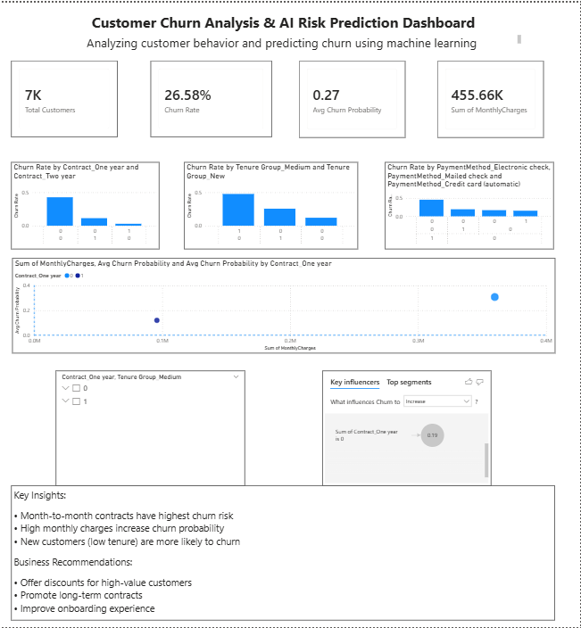

# Customer Churn Analysis & AI Prediction

## 📌 Overview
This project analyzes customer churn behavior and predicts high-risk customers using machine learning.

## 🛠️ Tech Stack
- SQL (Data Analysis)
- Python (Machine Learning)
- Power BI (Dashboard)
- SHAP (AI Explainability)

## 📊 Features
- Churn analysis by customer segments
- ML model to predict churn probability
- AI-based feature importance using SHAP
- Interactive Power BI dashboard

## 🤖 Model
- Algorithm: Random Forest
- Accuracy: ~80%
- Output: Churn probability

## 📈 Dashboard

## 🧠 Key Insights
- Month-to-month contracts have highest churn
- High monthly charges increase churn risk
- New customers churn more

## 💡 Business Recommendations
- Offer long-term contract incentives
- Target high-value customers
- Improve onboarding experience

## 🚀 Conclusion
This project demonstrates how data analysis and AI can help reduce customer churn.
